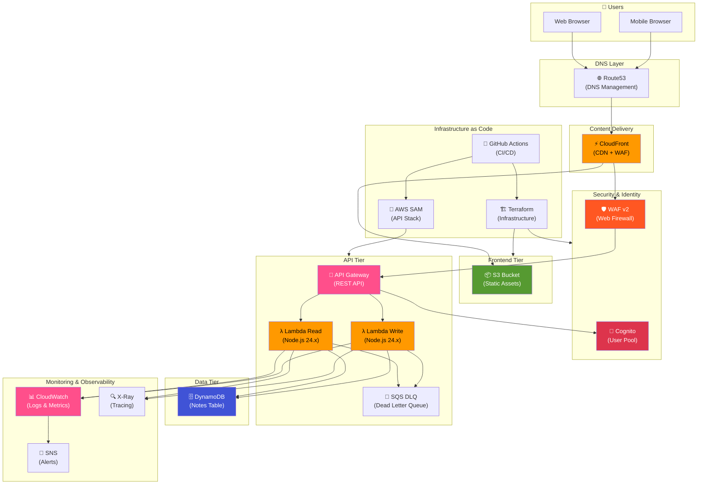
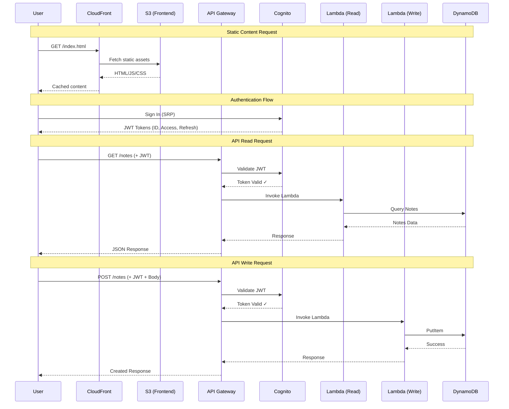
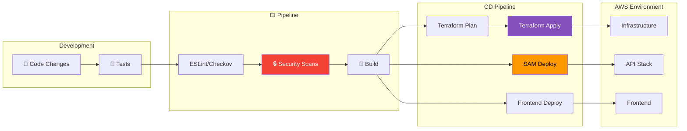
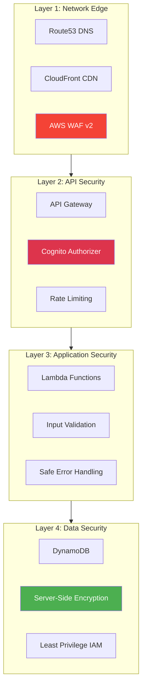
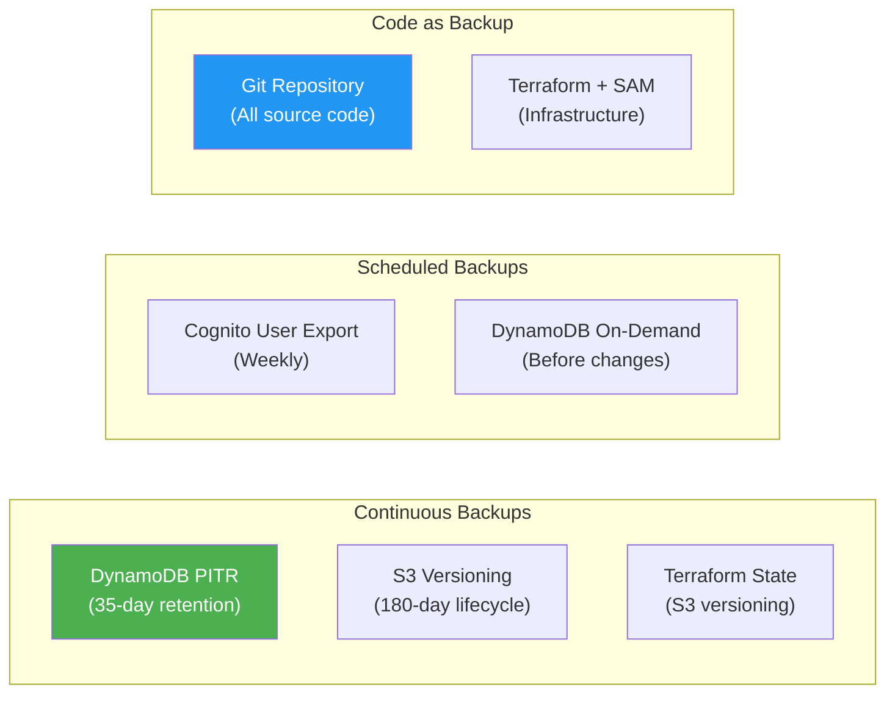

# d1-personal-note Architecture Document

## Table of Contents
1. [Executive Summary](#executive-summary)
2. [Architecture Overview](#architecture-overview)
3. [Architecture Diagram](#architecture-diagram)
4. [Service Selection & Justification](#service-selection--justification)
5. [Tech Stack](#tech-stack)
6. [Security Model](#security-model)
7. [Disaster Recovery Strategy](#disaster-recovery-strategy)
8. [Cost Management](#cost-management)
9. [Monitoring & Observability](#monitoring--observability)
10. [Future Considerations](#future-considerations)

---

## Executive Summary

**d1-personal-note** is a modern, serverless personal note-taking application built on AWS. The application follows a cloud-native architecture pattern, leveraging AWS managed services to minimize operational overhead while maximizing scalability, security, and cost-efficiency.

### Key Characteristics
- **Serverless-First Architecture**: No servers to manage, pay-per-use pricing
- **Single-Page Application (SPA)**: Modern React-based frontend
- **REST API**: Lambda-backed API Gateway for backend operations
- **NoSQL Database**: DynamoDB for flexible, scalable data storage
- **Infrastructure as Code**: Terraform + AWS SAM for reproducible deployments

---

## Architecture Overview

The application consists of three main tiers:

1. **Presentation Tier**: React SPA hosted on S3, delivered via CloudFront CDN
2. **Application Tier**: Serverless API using AWS Lambda behind API Gateway
3. **Data Tier**: DynamoDB for persistent storage, Cognito for identity management

### High-Level Flow
```
User → Route53 → CloudFront → S3 (Frontend Assets)
                     ↓
User → Route53 → API Gateway → Lambda → DynamoDB
                     ↓
              Cognito (Authentication)
```

---

## Architecture Diagram

### Complete System Architecture



### Request Flow Diagram



### Infrastructure Deployment Pipeline



---

## Service Selection & Justification

### Frontend Hosting

| Service | Selection | Justification |
|---------|-----------|---------------|
| **Amazon S3** | Selected | Cost-effective static hosting, high durability (11 9's), native AWS integration |
| **Amazon CloudFront** | Selected | Global CDN with 400+ edge locations, built-in DDoS protection, HTTPS enforcement |
| **AWS WAF v2** | Selected | Protects against OWASP Top 10 attacks, rate limiting for DDoS mitigation |
| **Route53** | Selected | DNS management with health checks, supports alias records for AWS services |
| **ACM** | Selected | Free SSL/TLS certificates for CloudFront, automatic renewal |

**Alternative Considered**: AWS Amplify Hosting
- *Rejected*: Less control over infrastructure, higher cost at scale

### API Layer

| Service | Selection | Justification |
|---------|-----------|---------------|
| **API Gateway (REST)** | Selected | Managed API service, built-in throttling, native Cognito integration |
| **AWS Lambda** | Selected | Serverless compute, pay-per-invocation, automatic scaling to zero |
| **Node.js 24.x Runtime** | Selected | LTS support, TypeScript compatibility, fast cold starts |
| **SQS Dead Letter Queue** | Selected | Captures failed invocations for debugging and replay |

**Alternative Considered**: HTTP API (API Gateway v2)
- *Rejected*: Limited authorizer caching, fewer features than REST API

**Alternative Considered**: AppSync (GraphQL)
- *Rejected*: GraphQL complexity not needed for simple CRUD operations

### Data Storage

| Service | Selection | Justification |
|---------|-----------|---------------|
| **Amazon DynamoDB** | Selected | Serverless NoSQL, single-digit millisecond latency, automatic scaling |
| **On-Demand Billing** | Selected | Pay-per-request, ideal for variable/unpredictable workloads |
| **Point-in-Time Recovery** | Recommended | Continuous backups, 35-day recovery window, ~5-min RPO |

**Alternative Considered**: Amazon RDS (PostgreSQL)
- *Rejected*: Requires capacity planning, higher baseline cost, server management

**Alternative Considered**: Amazon Aurora Serverless v2
- *Rejected*: Higher cost, more complex for simple key-value access patterns

### Authentication & Authorization

| Service | Selection | Justification |
|---------|-----------|---------------|
| **Amazon Cognito User Pools** | Selected | Managed identity service, MFA support, OAuth2/OIDC compliant |
| **SRP Authentication** | Selected | Secure Remote Password protocol, passwords never sent over network |
| **JWT Tokens** | Selected | Stateless authentication, API Gateway native validation |

**Alternative Considered**: Auth0 / Okta
- *Rejected*: Third-party dependency, additional cost, less AWS integration

**Alternative Considered**: Custom JWT with self-managed user store
- *Rejected*: Security risk, maintenance burden, no managed MFA

### Infrastructure as Code

| Service | Selection | Justification |
|---------|-----------|---------------|
| **Terraform** | Selected | Multi-cloud support, robust state management, mature ecosystem |
| **AWS SAM** | Selected | Simplified Lambda/API Gateway deployment, local testing support |
| **S3 + DynamoDB Backend** | Selected | Remote state with locking prevents concurrent modifications |

**Alternative Considered**: AWS CDK
- *Rejected*: Steeper learning curve, less declarative than Terraform

**Alternative Considered**: CloudFormation Only
- *Rejected*: Verbose syntax, limited abstraction capabilities

---

## Tech Stack

### Frontend

| Category | Technology | Version | Purpose |
|----------|------------|---------|---------|
| **Core Framework** | React | 18.3.1 | Component-based UI library |
| **Language** | TypeScript | ~5.9 | Type-safe JavaScript |
| **Build Tool** | Vite | 7.2.7 | Fast ESM-based bundler |
| **Styling** | Tailwind CSS | 4.1.18 | Utility-first CSS framework |
| **UI Components** | Material-UI (MUI) | 7.3.6 | Pre-built React components |
| **UI Primitives** | Radix UI | Various | Accessible component primitives |
| **HTTP Client** | Axios | 1.13.2 | HTTP requests with interceptors |
| **State Management** | TanStack React Query | 5.90.12 | Server state caching & synchronization |
| **Routing** | React Router | v6 | Client-side navigation |
| **Authentication** | AWS Amplify | 6.15.9 | Cognito SDK integration |
| **Testing** | Vitest | 4.0.16 | Vite-native test runner |
| **Testing Library** | React Testing Library | 16.3.1 | Component testing utilities |

### Backend (API)

| Category | Technology | Version | Purpose |
|----------|------------|---------|---------|
| **Runtime** | Node.js | 24.x | Lambda execution environment |
| **Language** | TypeScript | 5.9.3 | Type-safe JavaScript |
| **AWS SDK** | @aws-sdk/client-dynamodb | 3.954.0 | DynamoDB operations |
| **ID Generation** | ULID | 3.0.2 | Universally unique lexicographically sortable IDs |
| **Testing** | Jest | 30.2.0 | Unit testing framework |
| **Build** | esbuild | 0.27.2 | Fast TypeScript compilation |

### Infrastructure

| Category | Technology | Version | Purpose |
|----------|------------|---------|---------|
| **IaC (Infrastructure)** | Terraform | >= 1.0 | Core infrastructure provisioning |
| **IaC (Serverless)** | AWS SAM | Latest | Lambda/API Gateway deployment |
| **AWS Provider** | hashicorp/aws | ~> 5.0 | Terraform AWS resources |
| **State Backend** | S3 + DynamoDB | - | Remote state with locking |

### Security Scanning

| Tool | Purpose |
|------|---------|
| **Checkov** | Infrastructure security scanning |
| **Semgrep** | Static code analysis |
| **Gitleaks** | Secrets detection |
| **OWASP Dependency Check** | Vulnerability scanning |
| **OWASP ZAP** | Dynamic application security testing |
| **detect-secrets** | Pre-commit secrets detection |

---

## Security Model

### Defense in Depth Architecture



### Authentication & Authorization

| Control | Implementation | Details |
|---------|----------------|---------|
| **User Authentication** | AWS Cognito User Pools | Email-based sign-up/sign-in with verification |
| **Password Policy** | Cognito Configuration | Min 8 chars, uppercase, lowercase, numbers, symbols |
| **MFA** | Optional (Configurable) | TOTP-based second factor |
| **Token Management** | JWT (ID, Access, Refresh) | 60-min access tokens, 30-day refresh tokens |
| **Session Handling** | Cognito Managed | Token revocation, device tracking |
| **Authorization** | User-Scoped Data | All queries filtered by authenticated userId |

### Transport Security

| Control | Implementation |
|---------|----------------|
| **TLS Version** | TLSv1.2_2021 minimum |
| **HTTPS Enforcement** | CloudFront redirect HTTP→HTTPS |
| **Certificate Management** | ACM with auto-renewal |
| **HSTS Headers** | CloudFront Security Headers Policy |

### Data Security

| Control | Implementation |
|---------|----------------|
| **Encryption at Rest** | DynamoDB SSE (AWS-owned key) |
| **S3 Encryption** | AES-256 server-side encryption |
| **CloudWatch Logs** | Optional KMS encryption |
| **SNS Topics** | AWS-managed KMS encryption |
| **Terraform State** | S3 versioning + DynamoDB locking |

### API Security

| Control | Implementation |
|---------|----------------|
| **CORS** | Configured allowed origins, methods, headers |
| **Input Validation** | Request body validation in Lambda handlers |
| **Error Handling** | Typed errors mapped to HTTP status codes |
| **Rate Limiting** | WAF rate-based rules (configurable limit) |
| **Request Tracing** | X-Ray distributed tracing |

### Infrastructure Security

| Control | Implementation |
|---------|----------------|
| **S3 Public Access Block** | All public access blocked |
| **Least Privilege IAM** | Function-specific policies (DynamoDBReadPolicy, DynamoDBCrudPolicy) |
| **Resource Tagging** | Environment, project, managed_by tags |
| **Deletion Protection** | Cognito User Pool, DynamoDB (configurable) |

### Web Application Firewall (WAF)

| Rule Set | Protection |
|----------|------------|
| **AWS Managed Core Rules** | OWASP Top 10 (SQLi, XSS, LFI, etc.) |
| **Rate Limiting** | Configurable requests per 5-minute window |
| **Visibility** | CloudWatch metrics, sampled requests |

### Security Scanning & DevSecOps

| Phase | Tools |
|-------|-------|
| **Pre-commit** | detect-secrets, gitleaks |
| **SAST** | Semgrep, Checkov |
| **SCA** | OWASP Dependency Check |
| **DAST** | OWASP ZAP (baseline + API scans) |
| **IaC Scanning** | Checkov (Terraform, SAM templates) |

---

## Disaster Recovery Strategy

### Recovery Objectives

| Metric | Definition | Target |
|--------|------------|--------|
| **RPO** | Recovery Point Objective (max data loss) | 5 minutes (DynamoDB PITR) |
| **RTO** | Recovery Time Objective (max downtime) | 2 hours (full recovery) |

### Component-Level Objectives

| Component | RPO | RTO | DR Strategy |
|-----------|-----|-----|-------------|
| **DynamoDB (Notes)** | 5 minutes | 1 hour | Point-in-Time Recovery (PITR) |
| **Cognito User Pool** | 24 hours | 4 hours | AWS Managed + User Export |
| **S3 (Frontend)** | 0 (Zero) | 30 minutes | Git repo + rebuild |
| **Lambda Functions** | 0 (Zero) | 15 minutes | Git repo + SAM deploy |
| **API Gateway** | 0 (Zero) | 15 minutes | SAM template |
| **CloudFront** | 0 (Zero) | 30 minutes | Terraform |
| **Terraform State** | Immediate | 1 hour | S3 versioning |

### Backup Strategy



### Recovery Procedures

| Scenario | Procedure | Recovery Time |
|----------|-----------|---------------|
| **Accidental Data Deletion** | DynamoDB PITR restore to new table | 1 hour |
| **Ransomware/Encryption** | PITR restore + credential rotation | 2 hours |
| **Lambda Code Corruption** | SAM redeploy from Git | 15 minutes |
| **Frontend Corruption** | npm build + S3 sync | 30 minutes |
| **Full Infrastructure Failure** | Terraform apply + SAM deploy | 2 hours |
| **Terraform State Corruption** | S3 version restore or import | 1 hour |
| **Cognito User Pool Deletion** | Recreate + user import | 4 hours |

### Testing Schedule

| Test Type | Frequency |
|-----------|-----------|
| DynamoDB PITR Restore | Quarterly |
| Lambda Rollback | Monthly |
| Frontend Rebuild | Monthly |
| Full Infrastructure Restore | Annually |
| Terraform State Recovery | Semi-annually |

### Multi-Region Considerations (Future)

For enhanced disaster recovery, consider:
1. **DynamoDB Global Tables** for cross-region replication
2. **S3 Cross-Region Replication** for static assets
3. **Route53 Health Checks** with failover routing
4. **Multi-region Terraform state** with regional backends

---

## Cost Management

### Monthly Cost Estimation (Low Traffic)

| Service | Estimated Cost | Notes |
|---------|----------------|-------|
| **Lambda** | $0-5 | First 1M requests free |
| **API Gateway** | $3-10 | $3.50 per million requests |
| **DynamoDB (On-Demand)** | $1-5 | Pay per read/write unit |
| **S3 + CloudFront** | $5-15 | Storage + data transfer |
| **Cognito** | $0-5 | First 50,000 MAUs free |
| **Route53** | $0.50-1 | Hosted zone + queries |
| **CloudWatch** | $0-5 | Logs + metrics |
| **WAF** | $5-10 | Web ACL + rules |
| **Total Estimate** | **$15-56/month** | Low-traffic workload |

### Cost Controls

| Control | Implementation |
|---------|----------------|
| **AWS Budgets** | Monthly alerts at 80% and 100% threshold |
| **On-Demand Throughput Limits** | DynamoDB max request units |
| **Lambda Memory Optimization** | 128 MB default (increase as needed) |
| **CloudFront Price Class** | PriceClass_100 (fewer edge locations) |
| **S3 Lifecycle Policies** | Transition to IA/Glacier, delete old versions |

---

## Monitoring & Observability

### CloudWatch Alarms

| Category | Metric | Threshold | Severity |
|----------|--------|-----------|----------|
| **API Health** | 5XXError | > 10 per 5min | Critical |
| **API Health** | 4XXError | > 100 per 5min | Warning |
| **API Latency** | Latency | > 3 seconds | Warning |
| **Lambda** | Errors | > 0 | Critical |
| **Lambda** | Throttles | > 0 | Critical |
| **Lambda** | Duration | > 8 seconds | Warning |
| **DynamoDB** | ReadThrottleEvents | > 5 | Critical |
| **DynamoDB** | WriteThrottleEvents | > 5 | Critical |
| **CloudFront** | 5xxErrorRate | > 1% | Critical |
| **Cognito** | UserAuthenticationErrors | > 10 | Warning |

### Composite Alarms

- **API Health Critical**: Triggers if ANY of: 5XX errors, Lambda errors, or Lambda throttles

### Dashboards

- **Incident Response Dashboard**: API Gateway, Lambda, DynamoDB metrics
- **CloudWatch Insights Queries**: Lambda errors, performance analysis

### Tracing

- **AWS X-Ray**: Enabled for Lambda functions and API Gateway
- **Distributed Tracing**: End-to-end request tracking

---

## Future Considerations

### Scalability Improvements
- [ ] DynamoDB Global Tables for multi-region support
- [ ] Lambda Provisioned Concurrency for consistent latency
- [ ] ElastiCache for frequently accessed data

### Feature Enhancements
- [ ] Real-time sync with AppSync/WebSockets
- [ ] File attachments with S3 presigned URLs
- [ ] Full-text search with OpenSearch

### Security Enhancements
- [ ] AWS Shield Advanced for enhanced DDoS protection
- [ ] AWS Secrets Manager for sensitive configuration
- [ ] VPC Endpoints for private AWS service access

### Operational Improvements
- [ ] Automated Chaos Engineering (AWS Fault Injection Simulator)
- [ ] Canary deployments with Lambda aliases
- [ ] Automated runbooks with Systems Manager

---

## Document Information

| Attribute | Value |
|-----------|-------|
| **Version** | 1.0 |
| **Created** | 2025-12-28 |
| **Author** | Architecture Team |
| **Last Updated** | 2025-12-28 |
| **Next Review** | 2026-03-28 |
| **Status** | Active |

### Related Documents
- [Disaster Recovery Plan](disaster-recovery.md)
- [Incident Response Plan](incident-response.md)
- [Disaster Recovery Exercise Guide](disaster-recovery-exercise.md)
