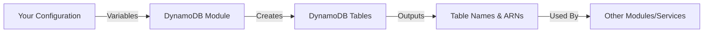

# DynamoDB Module

A beginner-friendly Terraform module for creating and managing AWS DynamoDB tables with best practices built in.

---

## 📚 Table of Contents

- [What This Module Does](#what-this-module-does)
- [Quick Start](#quick-start)
- [Module Overview](#module-overview)
- [Input Variables](#input-variables)
- [Outputs](#outputs)
- [Usage Examples](#usage-examples)
- [Best Practices](#best-practices)
- [Common Use Cases](#common-use-cases)
- [Cost Optimization](#cost-optimization)
- [Security Features](#security-features)
- [Troubleshooting](#troubleshooting)
- [Learning Resources](#learning-resources)

---

## What This Module Does

This module creates AWS DynamoDB tables with security and cost optimization features pre-configured. It's designed to be both production-ready and easy to learn from.

**DynamoDB** is AWS's fully managed NoSQL database service. Unlike traditional SQL databases (like MySQL or PostgreSQL), DynamoDB:
- Stores data as key-value pairs or documents
- Scales automatically to handle any amount of traffic
- Has no servers to manage or maintain
- Charges based on usage rather than provisioned capacity (when using on-demand mode)

**This module creates:**
- ✅ One or more DynamoDB tables
- ✅ Server-side encryption (enabled by default)
- ✅ Optional Time-to-Live (TTL) for automatic data expiration
- ✅ Optional deletion protection for production safety
- ✅ Optional throughput limits for cost control
- ✅ Proper tagging for organization and cost tracking

---

## Quick Start

### Minimal Example

Create a simple user table with default settings:

```hcl
module "dynamodb" {
  source      = "./modules/dynamodb"
  project     = "myapp"
  environment = "dev"
  
  tables = {
    users = {
      billing_mode                = "PAY_PER_REQUEST"
      table_class                 = "STANDARD"
      hash_key                    = "user_id"
      range_key                   = null
      attributes = [
        { name = "user_id", type = "S" }
      ]
      deletion_protection_enabled = false
      ttl_attribute               = null
      on_demand_throughput        = null
    }
  }
}
```

**Result:** Creates a table named `myapp-dev-users` with:
- On-demand billing (pay per request)
- String hash key: `user_id`
- No range key (simple key-value lookups)
- Encryption enabled automatically
- No deletion protection (easy to delete for dev/test)

---

## Module Overview

### Module Structure

```
modules/dynamodb/
├── main.tf       # Resource definitions (DynamoDB tables)
├── variables.tf  # Input parameters
├── outputs.tf    # Values exposed to other modules
└── README.md     # This file (documentation)
```

### How It Works



1. **Input:** You provide configuration (project name, environment, table settings)
2. **Processing:** Module creates DynamoDB tables with your settings
3. **Output:** Module returns table names and ARNs for use elsewhere

---

## Input Variables

### Required Variables

| Variable | Type | Description | Example |
|----------|------|-------------|---------|
| `project` | `string` | Project name for resource naming | `"myapp"` |
| `environment` | `string` | Environment name (dev, staging, prod) | `"prod"` |

### Optional Variables

| Variable | Type | Default | Description |
|----------|------|---------|-------------|
| `tables` | `map(object)` | `{}` | Map of tables to create (see structure below) |
| `tags` | `map(string)` | `{}` | Common tags for all resources |

### Table Configuration Structure

Each entry in the `tables` map requires these fields:

```hcl
tables = {
  table_name = {
    # How you pay for the table
    billing_mode = string  # "PAY_PER_REQUEST" or "PROVISIONED"
    
    # Storage tier for cost optimization
    table_class = string   # "STANDARD" or "STANDARD_INFREQUENT_ACCESS"
    
    # Primary key configuration
    hash_key  = string     # Required - partition key attribute name
    range_key = string     # Optional - sort key attribute name (or null)
    
    # Attribute definitions (only for keys/indexes)
    attributes = list(object({
      name = string        # Attribute name
      type = string        # "S" (string), "N" (number), or "B" (binary)
    }))
    
    # Safety features
    deletion_protection_enabled = bool  # true = prevents accidental deletion
    
    # Cost optimization
    ttl_attribute = string              # Attribute name for auto-expiration (or null)
    
    # Cost control for on-demand tables
    on_demand_throughput = object({
      max_read_request_units  = number  # Max reads/second
      max_write_request_units = number  # Max writes/second
    })  # or null for unlimited
  }
}
```

---

## Outputs

| Output | Type | Description | Usage |
|--------|------|-------------|-------|
| `table_name` | `map(string)` | Map of table names (key = logical name) | Application configuration, env vars |
| `table_arn` | `map(string)` | Map of table ARNs (key = logical name) | IAM policies, monitoring |

### Accessing Outputs

```hcl
# Get a specific table name
output "users_table" {
  value = module.dynamodb.table_name["users"]
  # Result: "myapp-prod-users"
}

# Get a specific table ARN for IAM policy
resource "aws_iam_policy" "lambda_dynamodb" {
  policy = jsonencode({
    Statement = [{
      Effect   = "Allow"
      Action   = ["dynamodb:GetItem", "dynamodb:PutItem"]
      Resource = [module.dynamodb.table_arn["users"]]
    }]
  })
}
```

---

## Usage Examples

### Example 1: Simple User Table

Perfect for getting started:

```hcl
module "dynamodb" {
  source      = "./modules/dynamodb"
  project     = "myapp"
  environment = "dev"
  
  tables = {
    users = {
      billing_mode                = "PAY_PER_REQUEST"
      table_class                 = "STANDARD"
      hash_key                    = "user_id"
      range_key                   = null
      attributes = [
        { name = "user_id", type = "S" }
      ]
      deletion_protection_enabled = false
      ttl_attribute               = null
      on_demand_throughput        = null
    }
  }
  
  tags = {
    Team    = "backend"
    Project = "myapp"
  }
}
```

**Use Case:** Simple user profile storage with unique user IDs.

---

### Example 2: Time-Series Data with Range Key

For storing events, logs, or orders sorted by time:

```hcl
module "dynamodb" {
  source      = "./modules/dynamodb"
  project     = "analytics"
  environment = "prod"
  
  tables = {
    events = {
      billing_mode                = "PAY_PER_REQUEST"
      table_class                 = "STANDARD"
      hash_key                    = "user_id"
      range_key                   = "timestamp"
      attributes = [
        { name = "user_id",   type = "S" },
        { name = "timestamp", type = "N" }
      ]
      deletion_protection_enabled = true
      ttl_attribute               = null
      on_demand_throughput        = null
    }
  }
}
```

**Use Case:** Query all events for a user within a date range.

**Query Example:**
```
Get all events for user123 between timestamps 1700000000 and 1700086400
```

---

### Example 3: Session Store with Auto-Expiration

Perfect for temporary data that should automatically delete:

```hcl
module "dynamodb" {
  source      = "./modules/dynamodb"
  project     = "webapp"
  environment = "prod"
  
  tables = {
    sessions = {
      billing_mode                = "PAY_PER_REQUEST"
      table_class                 = "STANDARD"
      hash_key                    = "session_id"
      range_key                   = null
      attributes = [
        { name = "session_id", type = "S" }
      ]
      deletion_protection_enabled = true
      ttl_attribute               = "expires_at"  # Auto-delete expired sessions
      on_demand_throughput        = null
    }
  }
}
```

**Item Structure:**
```json
{
  "session_id": "abc123def456",
  "user_id": "user789",
  "expires_at": 1703289600,
  "data": { "cart": [...] }
}
```

**Behavior:** Items automatically deleted after `expires_at` timestamp (within 48 hours).

**Cost Benefit:** TTL deletions are FREE!

---

### Example 4: Multiple Tables with Cost Controls

Create multiple tables with different configurations:

```hcl
module "dynamodb" {
  source      = "./modules/dynamodb"
  project     = "myapp"
  environment = "dev"
  
  tables = {
    # High-traffic table with throughput limits
    users = {
      billing_mode                = "PAY_PER_REQUEST"
      table_class                 = "STANDARD"
      hash_key                    = "user_id"
      range_key                   = null
      attributes = [
        { name = "user_id", type = "S" }
      ]
      deletion_protection_enabled = false
      ttl_attribute               = null
      on_demand_throughput = {
        max_read_request_units  = 5000
        max_write_request_units = 2000
      }
    }
    
    # Archive table with infrequent access
    audit_logs = {
      billing_mode                = "PAY_PER_REQUEST"
      table_class                 = "STANDARD_INFREQUENT_ACCESS"  # 50% cheaper storage
      hash_key                    = "log_id"
      range_key                   = "timestamp"
      attributes = [
        { name = "log_id",    type = "S" },
        { name = "timestamp", type = "N" }
      ]
      deletion_protection_enabled = false
      ttl_attribute               = "expires_at"  # Delete after 90 days
      on_demand_throughput        = null
    }
  }
  
  tags = {
    Environment = "development"
    Owner       = "devops-team"
  }
}
```

---

### Example 5: Production-Ready Configuration

Full production setup with all safety features:

```hcl
module "dynamodb" {
  source      = "./modules/dynamodb"
  project     = "myapp"
  environment = "prod"
  
  tables = {
    users = {
      billing_mode                = "PAY_PER_REQUEST"
      table_class                 = "STANDARD"
      hash_key                    = "user_id"
      range_key                   = null
      attributes = [
        { name = "user_id", type = "S" }
      ]
      deletion_protection_enabled = true  # ⚠️ CANNOT delete without manual action
      ttl_attribute               = null
      on_demand_throughput        = null  # Unlimited scaling for production
    }
    
    orders = {
      billing_mode                = "PAY_PER_REQUEST"
      table_class                 = "STANDARD"
      hash_key                    = "user_id"
      range_key                   = "order_id"
      attributes = [
        { name = "user_id",  type = "S" },
        { name = "order_id", type = "S" }
      ]
      deletion_protection_enabled = true
      ttl_attribute               = null
      on_demand_throughput        = null
    }
  }
  
  tags = {
    Environment = "production"
    Backup      = "daily"
    Compliance  = "required"
    CostCenter  = "engineering"
  }
}
```

---

## Best Practices

### 🔐 Security

✅ **DO:**
- Enable deletion protection for production tables
- Use IAM policies to restrict access (use output ARNs)
- Enable CloudTrail logging for audit trails
- Rotate credentials regularly

❌ **DON'T:**
- Store sensitive data unencrypted (encryption is automatic)
- Use overly permissive IAM policies (`dynamodb:*`)
- Disable deletion protection in production
- Share tables across environments

### 💰 Cost Optimization

✅ **DO:**
- Use `STANDARD_INFREQUENT_ACCESS` for rarely accessed data
- Enable TTL for temporary data (deletions are free)
- Set `on_demand_throughput` limits in development
- Monitor costs with proper tagging
- Consider `PROVISIONED` billing for predictable, steady traffic

❌ **DON'T:**
- Over-provision capacity in PROVISIONED mode
- Forget to clean up test tables
- Use on-demand mode without throughput limits in dev
- Store large binary data (consider S3 instead)

### 🏗️ Architecture

✅ **DO:**
- Choose partition keys with high cardinality
- Design for access patterns (not normalization)
- Use composite keys (hash + range) for relationships
- Plan for future query patterns

❌ **DON'T:**
- Use low-cardinality partition keys (status, type)
- Create "hot partitions" (one key accessed much more)
- Over-use Global Secondary Indexes (GSI) - they cost extra
- Design like a relational database (different paradigm!)

### 📝 Naming

✅ **DO:**
- Use consistent naming: `{project}-{environment}-{table}`
- Use descriptive table names: `users`, `orders`, `sessions`
- Follow your organization's naming conventions
- Include environment in the name

❌ **DON'T:**
- Use generic names: `table1`, `data`, `test`
- Mix naming styles across projects
- Use special characters (stick to alphanumeric and hyphens)

---

## Common Use Cases

### 1. User Profile Storage
```
Hash Key: user_id (S)
Range Key: none
Use Case: Simple key-value lookups by user ID
```

### 2. E-commerce Orders
```
Hash Key: user_id (S)
Range Key: order_date (N)
Use Case: Query all orders for a user, sorted by date
```

### 3. Session Management
```
Hash Key: session_id (S)
Range Key: none
TTL: expires_at
Use Case: Store temporary session data with auto-expiration
```

### 4. Time-Series Logs
```
Hash Key: device_id (S)
Range Key: timestamp (N)
Table Class: INFREQUENT_ACCESS (if old data)
Use Case: Store device metrics, query by time range
```

### 5. Gaming Leaderboard
```
Hash Key: game_id (S)
Range Key: score (N)
Use Case: Query top scores per game
```

---

## Cost Optimization

### Understanding Costs

**On-Demand Billing (PAY_PER_REQUEST):**
- **Reads:** $0.25 per million read request units
- **Writes:** $1.25 per million write request units
- **Storage:** $0.25 per GB-month
- **No minimum cost**

**Calculation Example:**
```
1 million reads/month:  $0.25
1 million writes/month: $1.25
10 GB storage:          $2.50
Total:                  $4.00/month
```

### Cost-Saving Tips

1. **Use TTL for temporary data** → Free deletions
2. **Use INFREQUENT_ACCESS for archives** → 50% cheaper storage
3. **Set throughput limits in dev** → Prevent runaway costs
4. **Monitor with CloudWatch** → Identify expensive queries
5. **Consider PROVISIONED for steady traffic** → 20-40% savings

### Table Class Comparison

| Metric | STANDARD | INFREQUENT_ACCESS | Savings |
|--------|----------|-------------------|---------|
| Storage (per GB) | $0.25 | $0.125 | 50% |
| Read cost | $0.25/M | $0.31/M | -24% |
| Write cost | $1.25/M | $1.56/M | -25% |

**Best for IA:** Data accessed < 1x/month with storage > 10 GB

---

## Security Features

### Built-in Security

✅ **Server-Side Encryption**
- Enabled by default (AWS owned keys)
- Data encrypted at rest
- No additional cost

✅ **Deletion Protection**
- Prevents accidental table deletion
- Requires two-step disable process
- Recommended for all production tables

### Additional Security (Not in Module)

Consider adding separately:
- Point-in-Time Recovery (PITR) for backups
- VPC Endpoints for private access
- AWS Backup for automated backups
- Fine-grained access control (IAM policies per item)

---

## Troubleshooting

### Common Errors

#### Error: "Attribute not defined"
```
Error: attribute "email" not found
```
**Cause:** Using an attribute in a key/index that's not defined in `attributes`.

**Solution:** Add the attribute to your `attributes` list:
```hcl
attributes = [
  { name = "user_id", type = "S" },
  { name = "email",   type = "S" }  # Add this
]
```

---

#### Error: "Cannot delete table"
```
Error: deletion protection is enabled
```
**Cause:** `deletion_protection_enabled = true`

**Solution:** Either:
1. Set `deletion_protection_enabled = false`, apply, then destroy
2. Manually disable in AWS console, then run `terraform destroy`

---

#### Error: "Throttling exception"
```
Error: ProvisionedThroughputExceededException
```
**Cause:** Hit throughput limits (on_demand_throughput caps).

**Solution:** Either:
1. Increase limits in `on_demand_throughput`
2. Set to `null` for unlimited (but watch costs!)
3. Optimize your queries to reduce requests

---

### Performance Issues

**Slow queries?**
- Check if you're doing a full table scan (expensive!)
- Consider adding a Global Secondary Index (GSI)
- Ensure partition key has good distribution

**High costs?**
- Check CloudWatch metrics for request counts
- Look for inefficient queries (repeated scans)
- Verify on_demand vs provisioned billing mode choice

---

## Learning Resources

### Official Documentation
- [AWS DynamoDB Documentation](https://docs.aws.amazon.com/dynamodb/)
- [DynamoDB Best Practices](https://docs.aws.amazon.com/amazondynamodb/latest/developerguide/best-practices.html)
- [Terraform AWS Provider - DynamoDB](https://registry.terraform.io/providers/hashicorp/aws/latest/docs/resources/dynamodb_table)

### Key Concepts to Learn
1. **Partition Keys vs Sort Keys** - Understand key design
2. **Global Secondary Indexes (GSI)** - For alternate query patterns
3. **DynamoDB Streams** - For change data capture
4. **Conditional Writes** - For optimistic locking
5. **Batch Operations** - For efficiency

### Recommended Learning Path
1. Start with simple hash-only tables
2. Experiment with composite keys (hash + range)
3. Learn about access patterns vs normalization
4. Explore GSIs when you need alternate queries
5. Study capacity modes (on-demand vs provisioned)

---

## Module Maintenance

### Version History
- **v1.0.0** - Initial release with core features

### Contributing
When modifying this module:
1. Update all three files: `main.tf`, `variables.tf`, `outputs.tf`
2. Add tests for new features
3. Update this README with examples
4. Follow the coding standards in `.copilot/terraform.md`

### Future Enhancements
Potential additions (not yet implemented):
- [ ] Global Secondary Indexes (GSI)
- [ ] Local Secondary Indexes (LSI)
- [ ] DynamoDB Streams configuration
- [ ] Point-in-Time Recovery (PITR)
- [ ] Replica configuration for global tables
- [ ] Auto-scaling for provisioned capacity

---

## Questions?

**Need help?** Review the inline comments in:
- [`main.tf`](main.tf) - Detailed resource explanations
- [`variables.tf`](variables.tf) - Input parameter documentation
- [`outputs.tf`](outputs.tf) - Output usage examples

**Still stuck?** Common issues are usually:
1. Attribute not defined in `attributes` list
2. Wrong data type (S vs N vs B)
3. Partition key with poor distribution
4. Deletion protection preventing destroy

---

## Example: Complete Working Configuration

Here's a full, copy-paste-ready example:

```hcl
# main.tf
module "dynamodb" {
  source      = "./modules/dynamodb"
  project     = "myapp"
  environment = "prod"
  
  tables = {
    users = {
      billing_mode                = "PAY_PER_REQUEST"
      table_class                 = "STANDARD"
      hash_key                    = "user_id"
      range_key                   = null
      attributes = [
        { name = "user_id", type = "S" }
      ]
      deletion_protection_enabled = true
      ttl_attribute               = null
      on_demand_throughput        = null
    }
  }
  
  tags = {
    Environment = "production"
    ManagedBy   = "terraform"
  }
}

# outputs.tf
output "users_table_name" {
  value = module.dynamodb.table_name["users"]
}

output "users_table_arn" {
  value = module.dynamodb.table_arn["users"]
}
```

**Deploy:**
```bash
terraform init
terraform plan
terraform apply
```

**Result:**
```
Table Name: myapp-prod-users
ARN: arn:aws:dynamodb:us-east-1:123456789012:table/myapp-prod-users
```

---

## License

This module is part of your infrastructure codebase. Use according to your organization's policies.

---

**Last Updated:** December 22, 2025
